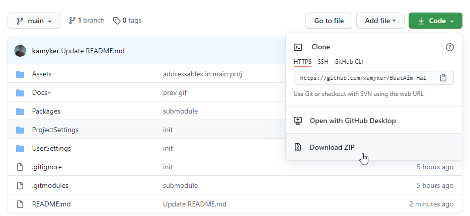

# Beat Aim Halloween

0. Get Unity 2020.1.8 https://unity3d.com/get-unity/download
1. Download and unzip this project (or git clone)

2. Open unzipped folder with Unity
3. On top of Unity click `BeatAim/Create Map`
4. Download(select only "models" and "textures" folders when importing): https://assetstore.unity.com/packages/3d/environments/fantasy/halloween-cemetery-set-19125
5. Download: https://assetstore.unity.com/packages/2d/textures-materials/floors/outdoor-ground-textures-12555
6. Click `Assets/Reimport All` in Unity
7. In Project window in `Assets/Map/Halloween` right click on HalloweenCustom and click Build Map
8. It may take some time to complete but don't worry it takes that long only once
9. Right click on `HalloweenCustom` again and `Show In Explorer`
10. Open `HalloweenCustomExported~` folder and copy `UnityData` folder
11. In Beat Aim select your map and click `Other/Open Folder`
12. Paste there the folder copied in 8.
13. Play :)

# Changing player path
The path that player follows can be changed by modifing animation attached to PlayerCart object in scene. Rebuild your map (steps from 6) to apply changes.

PlayerCart can also be exported as single object that way many Beat Aim Maps may use same Visual Map with different player paths. More info soon...
